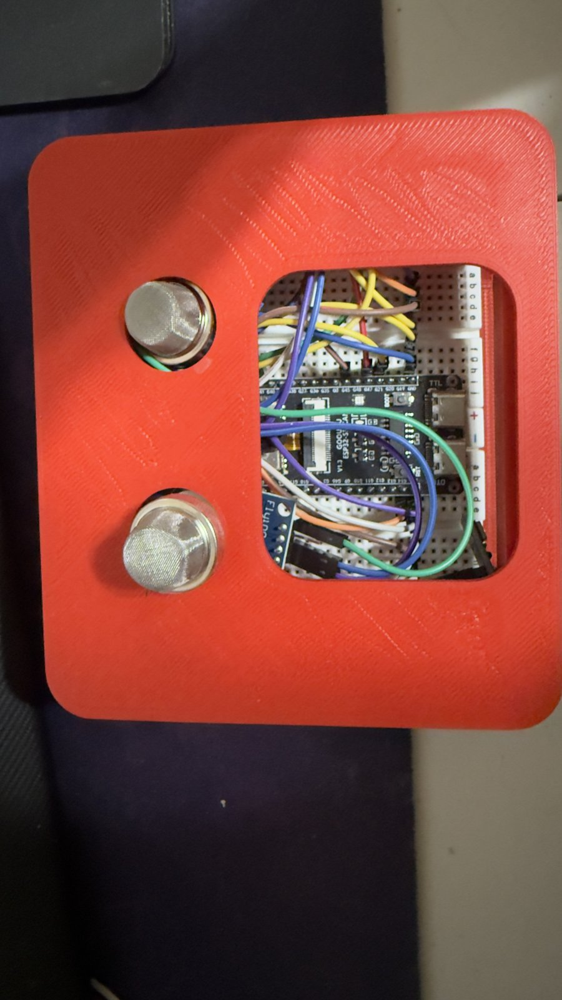
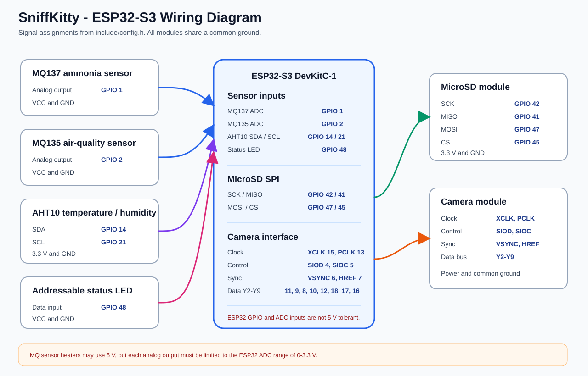
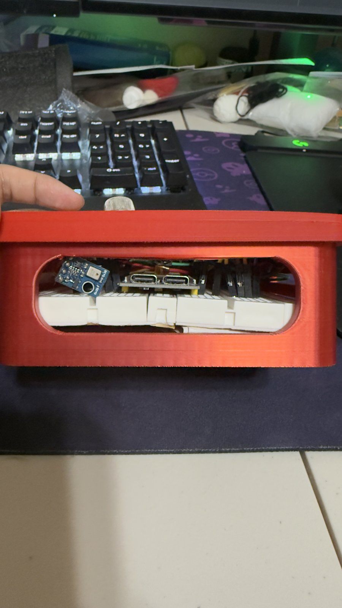
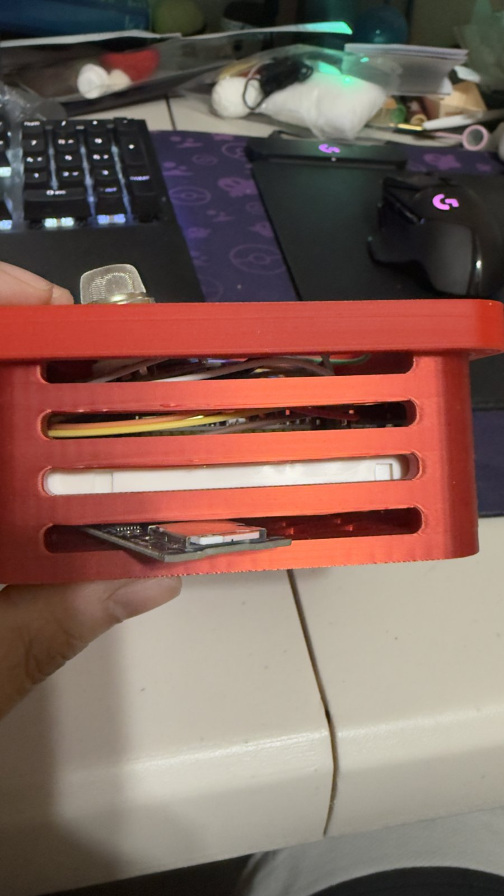
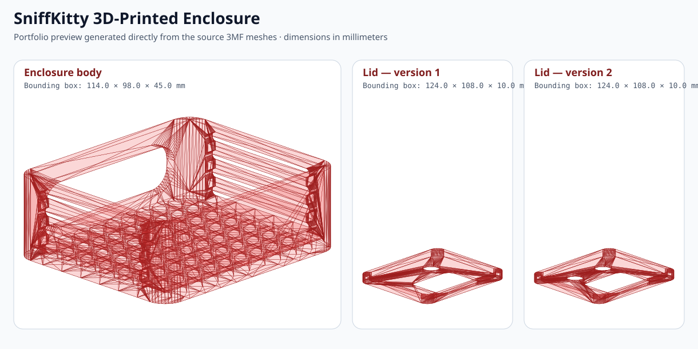

# SniffKitty

An ESP32-S3 multisensor system for monitoring odor changes around pet spaces. SniffKitty combines ammonia and air-quality sensing, temperature and humidity measurements, camera-based presence detection, local data logging, and a live web dashboard inside a custom 3D-printed enclosure.

> SniffKitty reports relative changes from a startup baseline. It is an engineering prototype, not a calibrated safety, health, or veterinary instrument.



## What it does

- Samples MQ137 and MQ135 analog gas sensors and compares readings with a clean-air startup baseline.
- Uses an AHT10 to record temperature and relative humidity.
- Detects pet presence from camera frame changes without sending images to a cloud service.
- Serves a live dashboard and camera stream from the ESP32-S3.
- Records timestamped sensor data to microSD and automatically retries after card failures.
- Captures a local photo when a new presence event begins.
- Provides an offline access-point mode when the configured Wi-Fi network is unavailable.
- Indicates odor-change severity through an addressable status LED.
- Exports serial readings to CSV through the included Python utility.

## System overview

```text
MQ137 ─┐
MQ135 ─┼─> ESP32-S3 ──> Web dashboard / camera stream
AHT10 ─┤       │
Camera ┘       ├──────> microSD CSV + event photos
               ├──────> status LED
               └──────> USB serial CSV capture
```



The full pin table, electrical notes, and signal descriptions are in [Hardware documentation](docs/HARDWARE.md).

## Hardware variants

Each branch is a self-contained, working hardware configuration from a different stage of the prototype. The `demo` branch is the most complete system and is the version documented throughout the rest of this README.

| Branch | Hardware configuration | Distinguishing features |
| --- | --- | --- |
| [`main`](https://github.com/antiank4/SniffKitty--ODOR-SENSOR/tree/main) | MQ135, PIR sensor, AHT10, camera, microSD, status LED | Stable PIR-triggered MQ135 build with live video and offline logging |
| [`feature`](https://github.com/antiank4/SniffKitty--ODOR-SENSOR/tree/feature) | MQ135, PIR sensor, AHT10, camera | Earlier v0.2 dashboard and chart build with PIR-triggered recording |
| [`mq137-version`](https://github.com/antiank4/SniffKitty--ODOR-SENSOR/tree/mq137-version) | MQ137, PIR sensor, AHT10, camera, microSD, status LED | Replaces MQ135 with the ammonia-sensitive MQ137 while retaining PIR presence detection |
| [`camera-detected-movement-version`](https://github.com/antiank4/SniffKitty--ODOR-SENSOR/tree/camera-detected-movement-version) | MQ137, AHT10, camera, microSD, status LED | Replaces the PIR sensor with camera-frame change detection |
| [`camera+mq135+mq137-version`](https://github.com/antiank4/SniffKitty--ODOR-SENSOR/tree/camera%2Bmq135%2Bmq137-version) | MQ135, MQ137, AHT10, camera, microSD, status LED | Adds dual gas sensing to the camera-presence design |
| [`time`](https://github.com/antiank4/SniffKitty--ODOR-SENSOR/tree/time) | MQ135, MQ137, AHT10, camera, microSD, status LED | Adds synchronized timestamps and a revised dashboard to the dual-sensor build |
| [`demo`](https://github.com/antiank4/SniffKitty--ODOR-SENSOR/tree/demo) | MQ135, MQ137, AHT10, camera, microSD, status LED | Final Demo Day build with tuned filtering, event photos, resilient storage, local access point, and enterprise Wi-Fi support |

## Prototype and enclosure

| Top | Front | Ventilated side |
| --- | --- | --- |
|  |  |  |

The enclosure was designed for 3D printing with openings for the two gas sensors, camera, controller ports, and passive airflow. Source SolidWorks and 3MF files are available in [`hardware/cad`](hardware/cad/).



## Hardware

- ESP32-S3 DevKitC-1 with 16 MB flash and PSRAM
- Camera module using an 8-bit DVP interface
- MQ137 ammonia-sensitive gas sensor module
- MQ135 air-quality gas sensor module
- AHT10 temperature and humidity sensor
- MicroSD card module
- Addressable status LED
- Breadboard, jumper wiring, and external power as required
- Custom 3D-printed enclosure

## Firmware setup

### 1. Install the toolchain

Install [Visual Studio Code](https://code.visualstudio.com/) and the PlatformIO extension, or install PlatformIO Core.

### 2. Configure Wi-Fi

Copy the example credentials file:

```text
include/wifi_credentials.example.h
```

to:

```text
include/wifi_credentials.h
```

Then replace the placeholder values. The real credentials file is excluded by `.gitignore` and must never be committed.

For a normal WPA/WPA2 network, provide `WIFI_SSID` and `WIFI_PASSWORD`. For eduroam or another WPA Enterprise network, leave `WIFI_PASSWORD` empty and provide the enterprise username and password.

### 3. Build and upload

From PlatformIO:

```bash
pio run
pio run --target upload
pio device monitor --baud 115200
```

The configured environment is `esp32s3cam`. On startup, the firmware initializes storage and the camera, connects Wi-Fi, calibrates both gas-sensor baselines for 30 seconds, and then begins monitoring.

### 4. Open the dashboard

The serial monitor prints the station IP address after a successful Wi-Fi connection. If station connection fails, connect to the local `SniffKitty-Demo` access point and use the IP address printed over serial.

## Serial CSV capture

Install PySerial:

```bash
python -m pip install pyserial
```

Update `PORT` in `save_gas_csv.py` for the connected board, then run:

```bash
python save_gas_csv.py
```

The current firmware records timestamps, presence state, raw and converted gas-sensor readings, relative change, status labels, temperature, humidity, and environmental deltas. The repository's `mq135_data.csv` is retained as an early prototype dataset and uses an older schema.

## My contribution

This was a three-person team project. My responsibilities included:

- All embedded firmware and supporting Python code
- Sensor acquisition, baseline calibration, filtering, and event-state logic
- Camera-based presence detection and local web dashboard
- Wi-Fi, offline access-point mode, NTP synchronization, and microSD logging
- Hardware integration, wiring, debugging, and physical prototype assembly
- 3D enclosure design, iteration, and printing

## Repository layout

```text
include/                 Firmware headers and embedded dashboard UI
src/                     ESP32-S3 firmware modules
docs/                    Photos, wiring diagram, and hardware documentation
hardware/cad/            SolidWorks and printable 3MF enclosure files
scripts/                 Documentation-generation utilities
save_gas_csv.py          Optional USB serial data logger
platformio.ini           Board and dependency configuration
```

## Known limitations and next steps

- Gas readings represent relative change, not calibrated gas concentration in ppm.
- Camera presence detection depends on lighting, placement, and threshold tuning.
- The prototype uses breadboard wiring; a future revision should use a custom PCB and protected power inputs.
- The serial capture utility currently requires its port to be edited manually.
- Automated firmware builds and hardware-independent tests have not yet been added.
